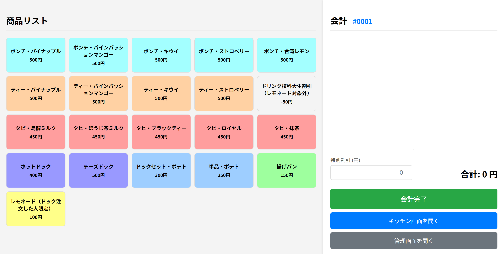
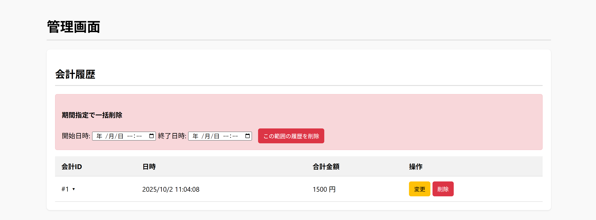
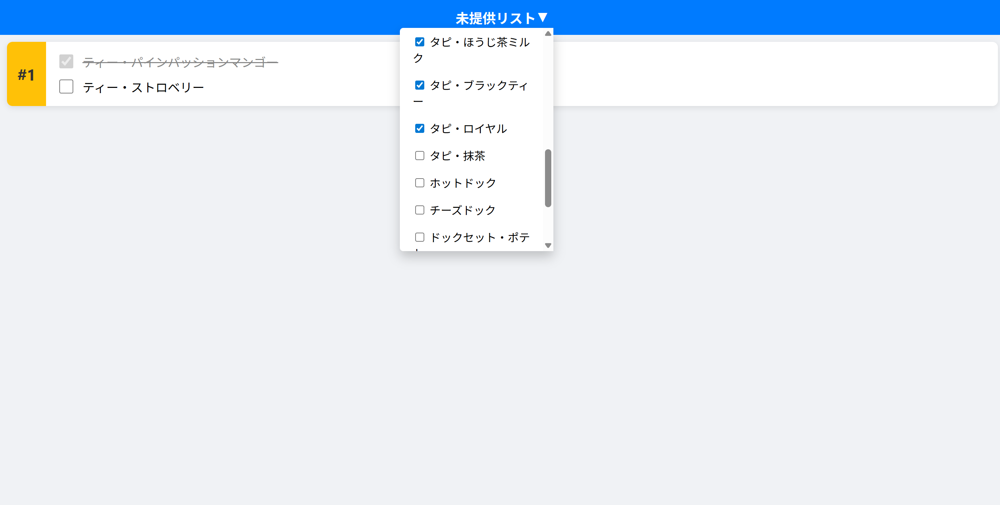
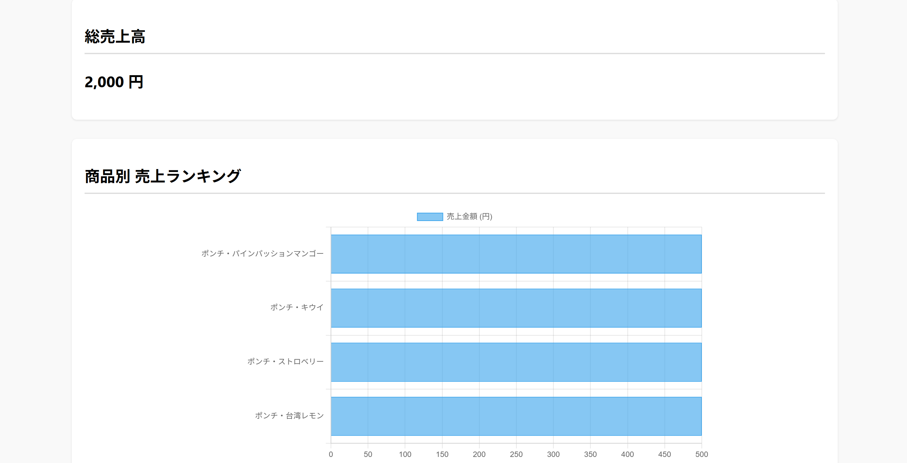

# 高機能POSシステム

これは、ウェブブラウザで動作する多機能な販売時点情報管理（POS）システムです。Vue.jsなどのモダンなフレームワークを使用せず、基本的なHTML、CSS、JavaScriptで構築されています。Node.jsとExpressを用いたサーバーサイドAPIを備えており、商品データと売上データをJSONファイルで永続化します。

## 主な機能

- **POS画面**:
  - タッチフレンドリーなUIで商品をカートに追加
  - 数量の増減、商品の削除
  - 割引機能（金額指定）
  - 会計処理とリアルタイムでの売上記録

- **管理画面**:
  - 商品の追加、編集、削除（CRUD）
  - 会計履歴の時系列での閲覧と個別削除
  - カレンダーを用いた期間指定による会計データの一括削除
  - 売上データのCSV形式でのダウンロード

- **キッチン画面**:
  - 未提供の注文をリアルタイムで表示
  - 商品ごとに提供済みステータスを更新可能
  - 全ての商品が提供されると注文が「提供済み」に自動更新

- **売上分析画面**:
  - 総売上高のダッシュボード表示
  - 商品別の売上数量と売上金額をランキング形式でテーブル表示
  - Chart.jsを利用した売上データのインタラクティブな棒グラフ

## スクリーンショット

### POS画面


### 管理画面

(images/admin-screen2.png)
(images/admin-screen3.png)

### キッチン画面


### 売上分析画面



## 技術スタック

- **フロントエンド**: HTML, CSS, JavaScript
- **バックエンド**: Node.js, Express
- **データストレージ**: JSONファイル
- **グラフ描画**: Chart.js

## セットアップと実行方法

### 前提条件
- Node.js (v14以上を推奨)
- npm (Node.jsに同梱)

### インストール
1.  このリポジトリをクローンまたはダウンロードします。
2.  ターミナルを開き、プロジェクトのルートディレクトリに移動します。
    ```bash
    cd path/to/your/project/POS
    ```
3.  必要なnpmパッケージをインストールします。
    ```bash
    npm install
    ```

### 実行
1.  以下のコマンドでサーバーを起動します。
    ```bash
    node server.js
    ```
2.  サーバーが起動すると、ターミナルに以下のメッセージが表示されます。
    ```
    サーバーがポート3000で起動しました。 http://localhost:3000 でアクセスしてください。
    ```
3.  ウェブブラウザを開き、`http://localhost:3000` にアクセスしてPOSシステムを利用します。

### アプリケーションの終了
- サーバーを実行しているターミナルで `Ctrl + C` を押すと、サーバーが停止します。

## データファイルについて

-   **商品データ**: `/data/products.json`
    -   管理画面から追加・編集した商品情報が保存されます。
-   **売上データ**: `/data/sales.json`
    -   POS画面での会計情報が全て記録されます。

これらのファイルは直接編集することも可能ですが、データの整合性を保つため、アプリケーションのUIを通して操作することを推奨します。

## APIエンドポイント

プロジェクトは以下のAPIエンドポイントを提供します。

| METHOD | PATH                                           | 説明                                       |
| :----- | :--------------------------------------------- | :----------------------------------------- |
| GET    | `/api/products`                                | 全ての商品リストを取得                     |
| POST   | `/api/products`                                | 新しい商品を追加                           |
| PUT    | `/api/products/:id`                            | 特定の商品を更新                           |
| DELETE | `/api/products/:id`                            | 特定の商品を削除                           |
| POST   | `/api/sales`                                   | 新しい会計を記録                           |
| GET    | `/api/sales/history`                           | 全ての会計履歴を取得                       |
| DELETE | `/api/sales/:id`                               | 特定の会計を削除                           |
| DELETE | `/api/sales`                                   | 指定期間の会計を一括削除                   |
| GET    | `/api/sales/csv`                               | 売上データをCSV形式でダウンロード          |
| GET    | `/api/sales/analytics`                         | 売上分析データを取得                       |
| GET    | `/api/kitchen/undelivered`                     | 未提供の注文リストを取得                   |
| POST   | `/api/kitchen/order/:orderId/item/:itemId/complete` | 特定注文の特定商品を完了ステータスに更新 |